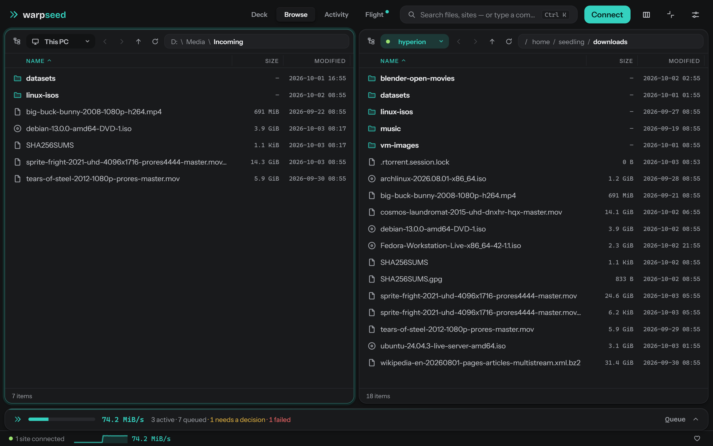

# warpseed

A file transfer app for Windows. It connects over SFTP, FTPS or plain FTP, sends big files over several connections at once so a slow server or long route doesn't hold it back, and resumes interrupted transfers where they stopped. The queue survives crashes and restarts.

This is the [cerkie/warpseed](https://github.com/cerkie/warpseed) fork of [ZyraLabs/warpseed](https://github.com/ZyraLabs/warpseed). Zyra Labs wrote the transfer engine, the queue and the design. The fork adds the features listed [below](#what-this-fork-adds). Bugs and ideas for the fork go in [this repo's issues](https://github.com/cerkie/warpseed/issues).

<p align="center">
  
</p>

## Download

Get the latest version from the [Releases page](https://github.com/cerkie/warpseed/releases/latest):

- **warpseed-amd64-installer.exe** installs it, with a Start menu entry and an uninstaller.
- **warpseed.exe** is the portable version. Run it from anywhere.

It needs 64-bit Windows 10 or 11 with WebView2 (Windows 11 has it already). There are no accounts and no telemetry.

The files aren't code-signed, so Windows SmartScreen will probably warn you the first time. Click "More info", then "Run anyway". GitHub shows a SHA-256 checksum next to each file on the release page if you want to verify your download, or you can [build it yourself](#building).

## Using it

1. Press **Connect**, pick a protocol, and enter the host, port and login.
2. The server's folders open in one pane and your PC's in the other.
3. Drag files across, or select them and press **F5**. To move files from your PC to a server instead of copying them, hold **Shift** while dragging or press **F6**.
4. Watch progress in the queue at the bottom, or in the Deck view.

**Ctrl+K** opens a search box for commands, sites and files. The [user guide](docs/user-guide.md) has the keyboard shortcuts, the settings and troubleshooting.

The app has four views:

- **Deck**: a dashboard of what's running, what finished and what failed.
- **Browse**: two file panes side by side, in the style of WinSCP.
- **Activity**: a timeline of everything that happened this session.
- **Flight**: a live picture of the connections. It only appears while something is queued or transferring.

Mini mode shrinks the window to a small always-on-top pill while transfers keep running. Press Escape to bring the window back.

<p align="center">
  
</p>

## How it works

**Hyperlane.** Many servers limit the speed of each connection, so one connection can't fill your line. For large files, warpseed splits the file into parts and sends each part on its own connection, up to 16 at once. The number of connections and the size at which it starts splitting are in Settings.

**Resume.** warpseed keeps track of how many bytes of each part it has saved. When you resume, it re-reads some of the already-saved data from the server and compares it with what's on disk. If it doesn't match, it starts that file over instead of finishing a damaged copy. A file only gets its real name once every byte has arrived.

**The queue.** Everything you queue is stored in a local database, so a crash or restart picks up where it left off. Failures are handled by type: a network hiccup is retried after a short wait, a server that refuses extra connections gets fewer of them, and a wrong password or a changed server identity stops the transfer straight away.

**SFTP, FTPS and FTP.** SFTP goes through Go's SSH and SFTP libraries and logs in with a password, a key file or the SSH agent. FTPS supports explicit and implicit TLS. Large FTPS downloads can use several connections too, but FTPS uploads use one connection per file, because the FTP protocol can't write into the middle of a remote file.

**Trust.** The first time you connect to a server, warpseed shows its SSH host key or TLS certificate fingerprint and asks whether to trust it. After that, a different key or certificate is treated as a warning, not retried. Passwords are kept in Windows Credential Manager, not in the app's database.

## What this fork adds

- **FTPS**, with a certificate check that works for the self-signed certificates most seedboxes use.
- **Faster FTPS downloads** over several connections, using the same settings as SFTP.
- **Moving files.** Hold Shift while dragging, or press F6, to move files from your PC to a server, or within one place. Files on a server are only ever copied to your PC, never moved.
- **SSH key and SSH agent login** for SFTP.
- **Plain FTP**, for servers that offer nothing else (unencrypted, so only use it on a network you trust).
- **A third pane**, so you can have your PC and two servers open at once. Two is still the default.
- **Drag and drop with Explorer.** Drop files on a server pane to upload them, or drag files out of a pane to copy them to Explorer or any file manager.
- **It remembers your setup.** Each pane's folder, the divider position, and which pane your server goes in. Each site can also connect automatically when warpseed starts.
- **A safer resume** for SFTP and FTPS: the end of a half-finished file is checked against the server before continuing.
- **Quicker transfer starts.**
- **Deleting local files uses the Recycle Bin.**
- **Smaller things.** Add, edit and delete sites in Settings, a bandwidth schedule, a desktop notification when the queue finishes, transfer history, hideable columns, clearer connection errors, and a new default theme called Graphite.

[docs/fork.md](docs/fork.md) lists where each of these lives in the code.

## Something broke?

Go to **Settings, then Data & About, then Report a bug**. It opens a new issue here with your version filled in. If you can, attach `warpseed.log` (there's an "Open log folder" button on the same screen). For speed problems, turn on "Verbose log" first, since it records timing for each connection. Please don't paste passwords or key files into an issue.

## Building

You need Go 1.25 or newer, Node 20 or newer, and the [Wails v2 CLI](https://wails.io).

```
go vet ./... && go test ./...
cd frontend && npm ci && npm run build && cd ..
wails build -clean -trimpath -nsis
```

That puts `warpseed.exe` and the installer in `build/bin`. The installer needs [NSIS](https://nsis.sourceforge.io) (`winget install NSIS.NSIS`). Leave off `-nsis` if you only want the exe. `-trimpath` keeps your local file paths out of the build.

It's written in Go with Wails v2. The interface is React with Vite, and the database is SQLite. The transfer code is in `internal/`, and `cmd/harness` runs real transfers against a real SSH server for testing.

To work on the interface without a server, run `npm run dev` in the `frontend` folder and open `http://localhost:5173/?mock=1`. Add `&theme=graphite`, `clay`, `cobalt` or `iris` to switch themes.

## Credits and license

warpseed was created by [Zyra Labs](https://zyralabs.tech), who accept donations [here](https://buymeacoffee.com/zyralabs) if it saves you time. MIT licensed, see [LICENSE](LICENSE).
