# warpseed — User Guide

warpseed is a fast, free transfer client for Windows built for seedbox
workloads: parallel connections, byte-level resume that survives errors
and restarts, and a queue you can leave running overnight.

This guide covers everything in version 1.2. If something here doesn't
match what you see, that's a bug — [report it](#getting-help).

---

## Contents

1. [Install](#install)
2. [First connection](#first-connection)
3. [The four views](#the-four-views)
4. [Browsing and transferring](#browsing-and-transferring)
5. [The queue](#the-queue)
6. [Hyperlane — multi-connection transfers](#hyperlane--multi-connection-transfers)
7. [Mini mode](#mini-mode)
8. [Settings](#settings)
9. [Keyboard reference](#keyboard-reference)
10. [Where your data lives](#where-your-data-lives)
11. [Troubleshooting](#troubleshooting)
12. [Getting help](#getting-help)

---

## Install

**Requirements:** Windows 10 or 11, 64-bit, with WebView2 (preinstalled on
Windows 11). If WebView2 is missing, warpseed offers to download it from
Microsoft on first run.

Apart from the servers you configure, warpseed makes exactly two other kinds
of connection, both of which you control: that WebView2 download, and a
once-per-run check with GitHub for a newer release. The update check sends no
identifiers and no usage data — it asks a public page what the latest version
is, and nothing about you goes with the question. Turn it off in
**Settings → About** if you would rather it did not happen at all. There is
still no telemetry of any kind, and warpseed never downloads or replaces
itself: if there is a new version, it tells you and opens the release page.

1. Download `warpseed.exe` from the
   [latest release](https://github.com/ZyraLabs/warpseed/releases/latest).
2. Put it anywhere — it's portable. No installer, no admin rights, no
   accounts, no telemetry.
3. Double-click to run.

**SmartScreen prompt.** The binary is currently unsigned, so Windows may
show "Windows protected your PC" the first time. Click **More info → Run
anyway**. To check you have a genuine build, compare the file's SHA-256
against `SHA256SUMS.txt` published alongside every release:

```powershell
Get-FileHash .\warpseed.exe -Algorithm SHA256
```

**Updating.** Download the new `warpseed.exe` and replace the old one. Your
sites, queue and settings are stored separately (see
[Where your data lives](#where-your-data-lives)) and carry over.

---

## First connection

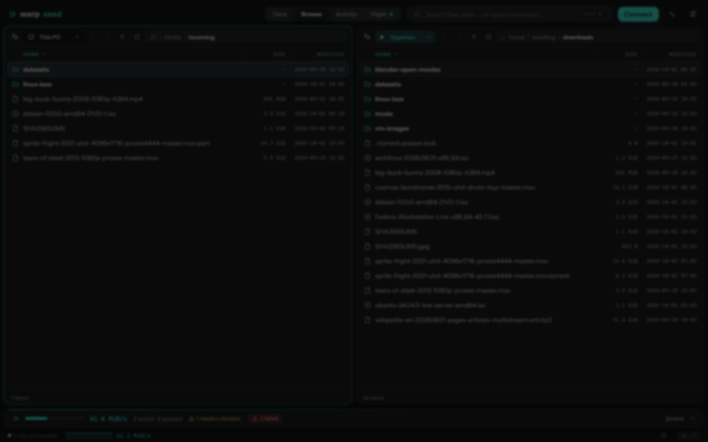

Click **Connect** in the header (or press **Ctrl+K** and choose **New
connection…**). Pick a saved site, or fill in a new one:

| Field | Notes |
|---|---|
| **Host** | e.g. `hyperion.example.com` |
| **Port** | `22` unless your provider says otherwise |
| **Site name** | Optional label; defaults to the host |
| **Username / Password** | The password is stored in **Windows Credential Manager**, never in a file |
| **Initial remote path** | Where the remote pane opens, e.g. `/home/you/downloads` |

Press **Connect**. Saved sites appear in the command palette (Ctrl+K →
"Connect: *name*") and can be edited later under **Settings → Sites**.

### Host key check

The first time you reach a server, warpseed shows its SSH host-key
fingerprint and asks you to **Trust & connect**. Compare it with the
fingerprint your seedbox provider publishes. After that the key is pinned:
if it ever changes, warpseed refuses to connect and tells you loudly —
that is the one situation where you should stop and check with your
provider before doing anything else.

> **SFTP and FTPS.** Log in with a password, a private key file or the SSH agent (SFTP). S3
> and WebDAV are planned.

---

## The four views

Switch views with the **Deck · Browse · Activity · Flight** control in the
header. The search box beside it is the command palette (**Ctrl+K**).

### Deck — the night's work at a glance

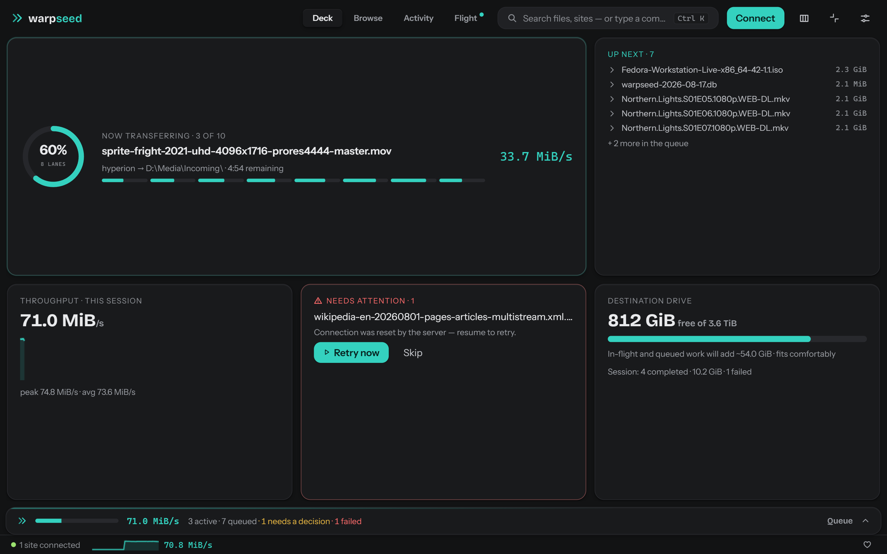

A dashboard: what's moving now, aggregate speed, what finished, what
failed. Open it in the morning to audit an overnight run.

### Browse — dual-pane commander


Two panes, each either your PC or a remote site. This is where you pick
files and start transfers. If you've used WinSCP, Total Commander or
Norton Commander, your hands already know it.

### Activity — the session as a story

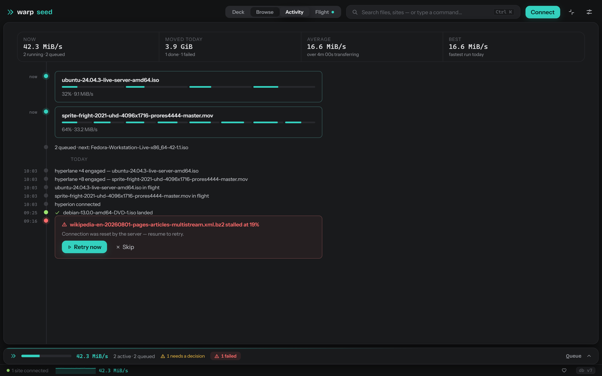

A timeline of everything that happened this session — connections,
transfers starting, finishing, retrying — in order.

### Flight — the pipeline, live

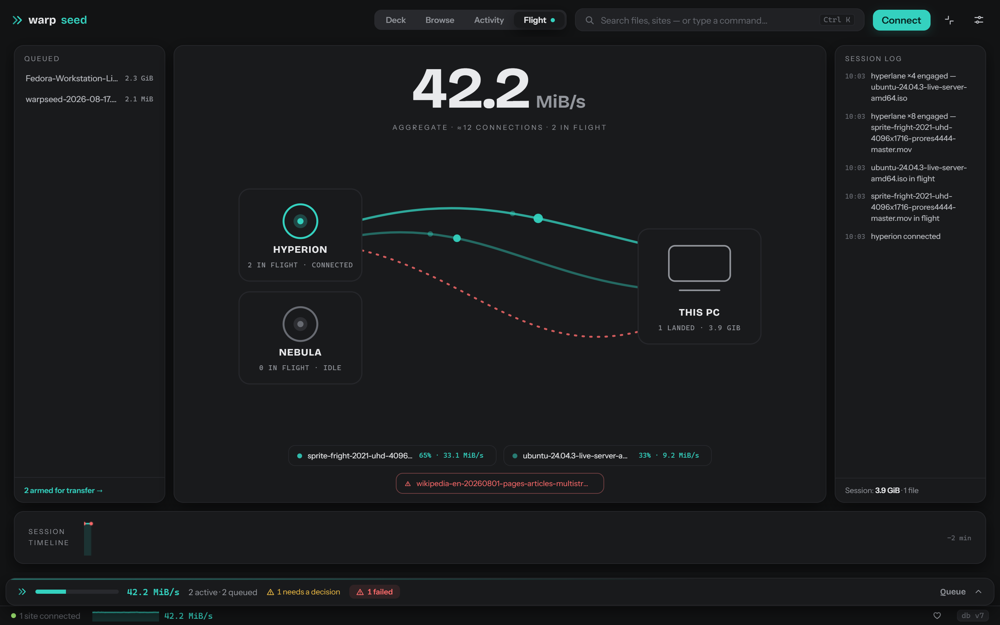

A live picture of each active transfer and its connections while data is
flowing. Appears once something is transferring.

---

## Browsing and transferring

- **Tab** switches the active pane. The active pane carries the accent
  colour.
- **Enter** opens a folder; **Backspace** goes up — and puts the cursor
  back on the folder you just came out of, so "up, look around, back
  down" costs two keystrokes. **Ctrl+L** turns the breadcrumb into an
  editable path.
- **Typing a filename jumps to it**, the way Windows Explorer does.
  Nothing is hidden; repeating one letter steps through the entries that
  start with it.
- **Ctrl+F** opens the filter strip and filters the listing as you type.
  **Esc** clears it — from the filter box or from the listing.
- **Click a column header** to sort by name, size or date; click it again
  to reverse. Sorting applies to **both panes** — it is one shared
  setting, remembered across restarts. **Ctrl+F3**, **Ctrl+F5** and
  **Ctrl+F6** do the same from the keyboard (name, modified, size).
- **Right-click empty space** in a listing for New folder, Refresh,
  Select all and the three sort options.
- **Switch a pane to This PC** or to a site from the command palette
  (Ctrl+K), or from the pane's source picker.

### Selecting

Two mechanisms coexist, commander-style:

- The **cursor** — one row, moved with the arrow keys.
- **Marks** — a sticky multi-selection. **Insert** marks the row and
  advances; **Space** marks without advancing; **\*** inverts;
  **Ctrl+Shift+A** clears. Ctrl+click and Shift+click work as you'd
  expect. The pane footer shows a running total of what's marked.
- **Shift** with the arrow keys, Home, End, PageUp or PageDown extends
  the selection from the anchor row.

Transfers act on the marks if there are any, otherwise on the cursor row.

### Transferring

You can also **drag files from one pane to the other**, which queues the
same transfer: drag from the site to This PC to download, the other way to
upload. Drop on the pane to use the folder it is showing, or drop straight
onto a folder row to put the files in that folder. Dragging a row that is
not part of your selection drags just that row.

Dragging *within* one pane does nothing, and neither does dragging between
two panes showing the same kind of place. That would be a move, which
deletes the original, and warpseed does not do moves yet — so those drags
are not offered at all rather than being refused after the fact.

- **F5** — transfer the selection to the other pane (download if the
  active pane is remote, upload if it's local). Items go straight into
  the queue and start as soon as a slot is free.
- **F7** — new folder · **F2** — rename · **F8** / **Delete** — delete
  (with confirmation).
- Right-click any row for the same actions as a context menu.

Downloads are written into the destination folder and confined to it —
a hostile filename on the server can't escape it.

---

## The queue

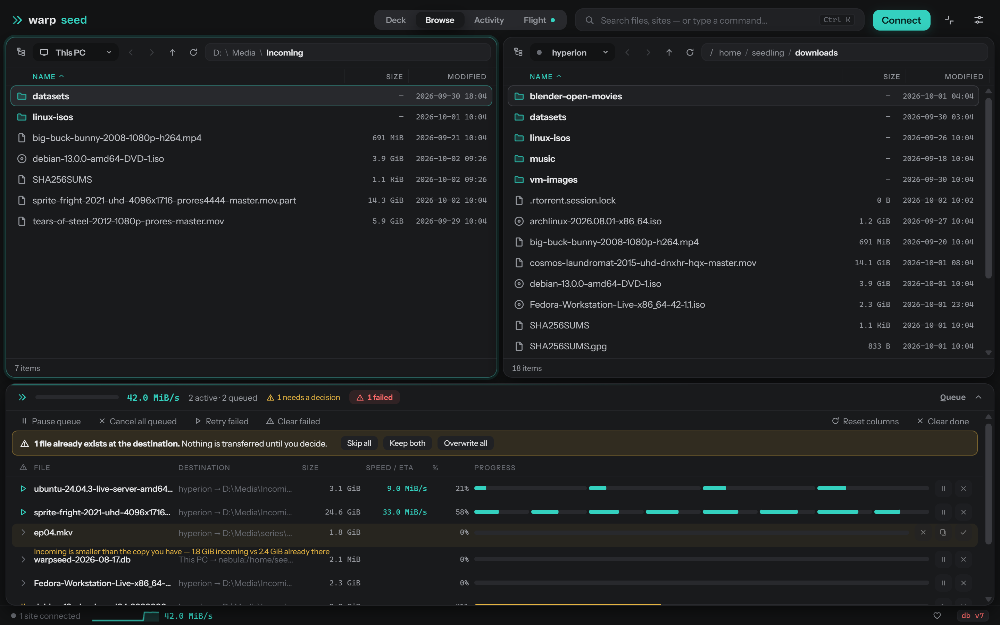

The queue dock lives at the bottom of the window and is never hidden. Even
collapsed it shows aggregate speed and counts; click it to expand.

Each row shows filename, route, progress, speed and ETA, and has
**pause / resume** and **cancel** buttons. Pause keeps everything so the
transfer continues from the same byte; cancel throws the part-transferred
data away, on your machine and on the server, and asks before it does. Items
from different sites coexist. The queue is persisted to disk, so closing warpseed (or a crash,
or a reboot) loses nothing — on next launch, unfinished transfers are
still there and resume from the exact byte they reached.

**Pause queue**, at the left of the queue toolbar, stops the whole queue:
nothing new starts, and running transfers stop and return to the queue with
their progress kept. **Resume queue** starts it again. The pause is
remembered across a restart, and Settings → **Queue on launch** → *Start
paused* makes every launch begin stopped, so last night's queue waits for
you instead of starting the moment the window opens.

To cancel several rows at once, click one to select it, Ctrl+click to add or
remove rows, Shift+click for a range, then press **Cancel selected** (or
Delete). **Cancel all queued** cancels everything waiting in the queue —
queued rows, paused rows, and rows a queue pause put back; the whole queue,
not just the rows on screen — and leaves running transfers alone. It always
asks first, and says how many of those rows hold part-transferred data;
Cancel selected asks only when data would be lost.

**States:** queued · active · paused · completed · failed · cancelled. Failed rows
show a plain-language reason and a **retry** button. Completed rows stay
for the session so you can audit them; **Clear done** purges them.

When anything has failed, two more buttons appear at the left of the queue
toolbar — one unplugged drive or one hour of a server refusing logins fails
a whole batch at once, and neither should be a row-by-row cleanup:

- **Retry failed** — requeues every failed transfer. Each one resumes from
  the byte it reached, so nothing is re-downloaded.
- **Clear failed** — removes them and deletes their part-downloaded data.
  Files cleared this way start from the beginning if you queue them again;
  finished files are never touched. A row whose data cannot be reached is
  kept rather than deleted — a failed upload while the site is disconnected,
  for instance — so nothing is ever left on a disk or a server with no queue
  row pointing at it.

The dock always shows everything in flight, plus up to 2,000 waiting rows
(the ones next in line), the newest 500 failed rows and the newest 200
finished rows. Queue a whole season folder and every row is there; the
queue itself has no limit, and rows beyond those windows are still worked
through — they simply appear as earlier ones finish.

### When the file already exists

warpseed checks the destination **before** it starts transferring, so a file
you already have is never re-downloaded just to be replaced at the end.

What happens is set per situation in **Settings → When the file already
exists**:

| Situation | Default |
|---|---|
| Incoming is newer and larger | Overwrite |
| Incoming is smaller | Ask |
| Incoming is older | Ask |
| Identical (same size and time) | Skip |
| Anything else | Ask |

Each can be **Overwrite**, **Skip**, **Keep both**, or **Ask**. Newer *and*
larger is the only case that replaces a file on its own — a bigger file with a
later date is nearly always a better copy of the same thing. Anything that
could be a downgrade asks.

**Ask** does not interrupt you. The file is queued but held, and the dock
says so: *"3 files already exist at the destination."* Each row shows why —
sizes and dates side by side — with **Skip**, **Keep both** and **Overwrite**
per row, or for all of them at once. A folder full of clashes is one decision
rather than a dialog per file. Held transfers use no connection and do not
hold up the rest of the queue.

**Keep both** transfers to a free name beside the existing file:
`ep01.mkv` becomes `ep01 (1).mkv`.

This applies to uploads as well — "incoming" is whichever file is being sent.

### Closing warpseed

Closing with transfers running asks first, and tells you what it means: the
progress is saved, those transfers are still queued next time you open
warpseed (and start straight away unless the queue is paused or set to start
paused), and each picks up from its last checkpoint — at most about 8 MB per
connection is re-sent. You can keep warpseed open, close and resume later, or minimize to the
pill and leave everything running.

Unfinished transfers keep their data in a placeholder file beside the
destination, ending `.wspart` or `.wschunk` — on the server for uploads. A
`.wschunk` already shows the final file size but is not finished. Leave those
files alone; warpseed needs them to resume.

With nothing transferring, warpseed closes straight away. **Settings → Closing**
chooses what the X button does when transfers *are* running: ask, close anyway,
or minimize to the pill.

### Before anything is deleted

Cancelling a transfer, clearing cancelled transfers from the queue, deleting
files, and deleting a saved site all ask first, and say what is about to go.
A transfer that has moved no bytes is cancelled without a prompt — there is
nothing to lose.

Each of those warnings can be switched off for the rest of the session with
**Don't ask again until warpseed restarts**. It silences only that one kind
of warning, and every launch starts asking again.

### Byte-level resume

Every transfer keeps per-chunk checkpoints. Pause, error, idle timeout,
network drop, restart — when it resumes, it verifies the checkpoint and
continues from that byte. No re-downloading a 40 GB file because the
connection blinked at 39 GB.

Verifying means reading the bytes back and comparing them, not trusting the
file's size. A part file is created at its full size before the first byte
arrives, so its size proves nothing: if the folder was restored from a
backup, or another tool wrote over the path, the length can still look
perfect while the contents are wrong. warpseed re-reads a window of every
completed lane from the server before resuming, and starts over rather than
finish a file it cannot vouch for.

Queuing the same file twice does not transfer it twice — one row per
destination runs at a time, and re-queuing something already waiting gives
you back the row you already have.

---

## Hyperlane — multi-connection transfers

Most seedboxes cap the speed of **each connection** (commonly ~5 MiB/s)
rather than your account. A single-connection client can never beat that
cap on a single file.

Hyperlane splits one large file across several connections — up to 16
"lanes" — each moving its own byte range into the same pre-allocated
file. Eight lanes at 5 MiB/s each is 40 MiB/s for one file. In the queue,
a Hyperlane transfer shows a segmented progress bar, one segment per lane.

Uploads use lanes too, and they have **their own settings**. An upload
link saturates at far fewer connections than a download link — typically
around three — so one number cannot serve both directions.

Settings has one section per direction.

**Settings → Hyperlane · Downloads**

- **Lanes per file** — 1–16 connections (1 = off, default 4). Start at 8;
  if your provider limits connections per IP, stay under that limit.
- **Engage above** — files smaller than this (default 256 MB) use a single
  connection, since lane setup costs more than it saves on small files.

**Settings → Hyperlane · Uploads**

- **Lanes per file** — 1–16 connections (default 3). Upload speed usually
  caps out around three lanes; more connections cost handshakes without
  adding throughput.
- **Engage above** — default 128 MB.

The two sections are independent. If you raised the download lane count
on an earlier version, your uploads stay at the upload default until you
raise that one too.

Remember that lanes count against your per-site connection cap (see
[Settings → Transfers](#settings)).

---

## Mini mode


Click **Minimize to pill** in the header and warpseed shrinks to a small
always-on-top strip showing live transfer state. Work in other windows and
keep an eye on the run. Click the pill or press **Escape** to bring the
full window back.

---

## Settings

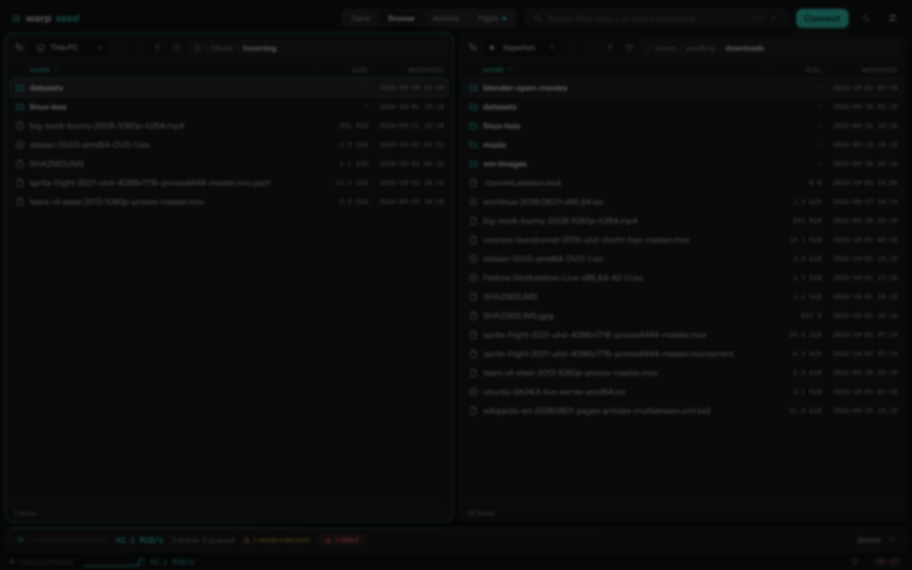

Open with **Ctrl+,** or the gear icon.

**Appearance** — four themes: **Graphite** (default, dark with a teal accent), **Clay** (warm light),
**Cobalt** (cool light) and **Iris** (dark).

| Graphite (default) | Clay |
|---|---|
| 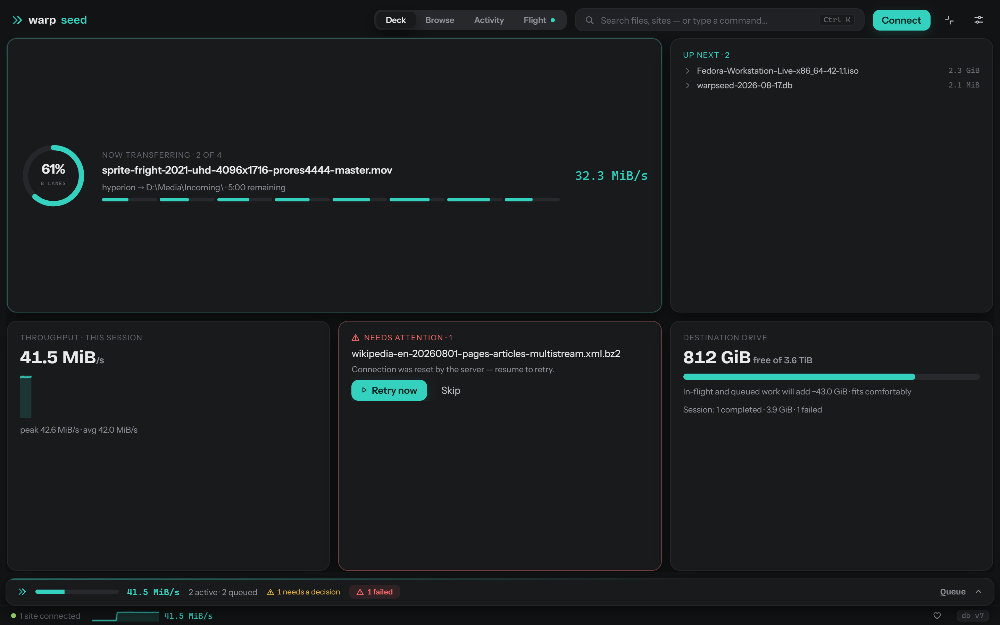 | 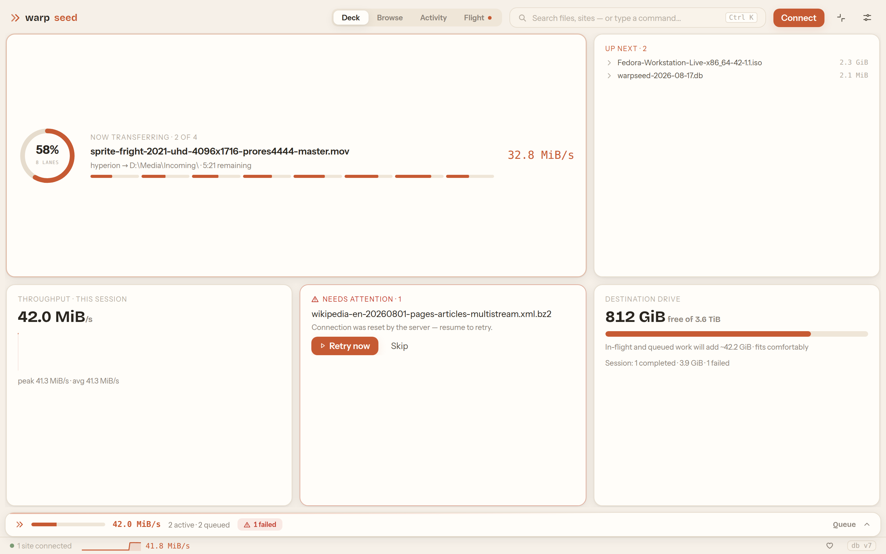 |

| Cobalt | Iris |
|---|---|
| 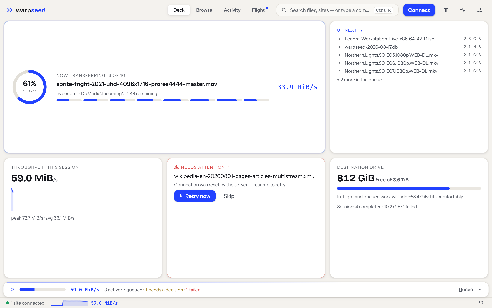 | 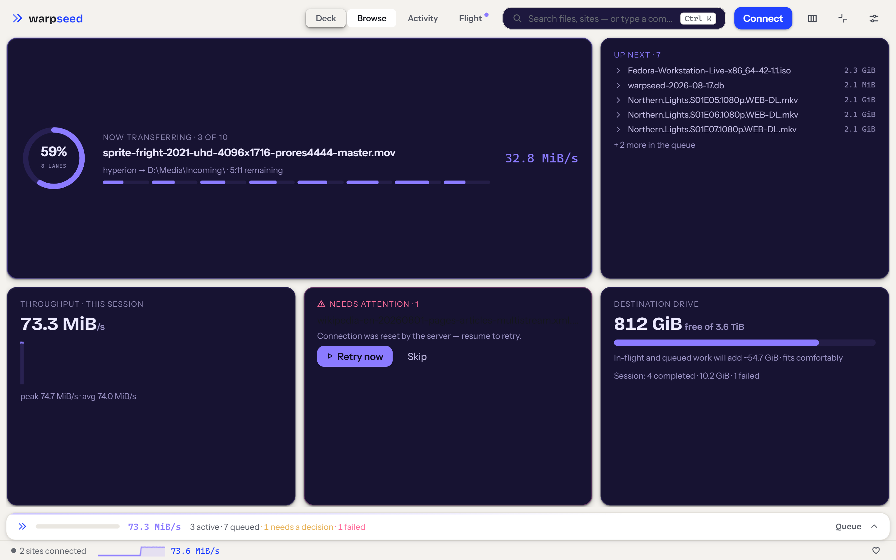 |

**Transfers** — these are connection budgets, not file counts. A Hyperlane
file spends one connection per lane, so the budget decides how many files
run at once: 8 connections runs two 4-lane files, and a budget below the
lane count narrows Hyperlane rather than queueing.
- *Connections, all sites* — total across every site (1–16, default 6).
- *Connections per site* — the default per site (1–8, default 3). Sites can
  override this individually. Keep it at or below what your server allows.

A file waits for its full lane count rather than starting on a spare
connection, so a queue of large files runs them one at a time at full
width instead of all of them at one connection's speed.

**Hyperlane · Downloads** and **Hyperlane · Uploads** — see
[above](#hyperlane--multi-connection-transfers).

**Bandwidth** — *Off*, *Fixed* (a MiB/s ceiling), or *% of max* (throttle
to a percentage of your measured maximum, so a big run doesn't flatten
the rest of your network).

**Sites** — edit or delete saved sites: name, host, port, username,
password, initial remote path, and a per-site max-transfers override.

**Data** — shows where the settings/queue database lives, with buttons
to open that folder and to make a backup copy.

**About** — version, links to zyralabs.tech, **Report a bug** (opens a new
issue on github.com/cerkie/warpseed with the version pre-filled), and
**Support warpseed**.

---

## Keyboard reference

| Key | Action |
|---|---|
| **Tab** | Switch active pane |
| **Enter** | Open folder |
| **Backspace** | Parent folder |
| **Ctrl+L** | Edit path |
| **Ctrl+F** | Filter listing (Esc clears) |
| **Ctrl+R** | Refresh listing |
| **Insert** | Mark and advance |
| **Space** | Mark (no advance) |
| **\*** | Invert marks |
| **Ctrl+Shift+A** | Deselect all |
| **F5** | Transfer selection to other pane |
| **F7** | New folder |
| **F2** | Rename |
| **F8** / **Delete** | Delete |
| **Ctrl+K** | Command palette |
| **Ctrl+,** | Settings |
| **Esc** | Clear filter → close dialog → leave mini mode |

The command palette (**Ctrl+K**) lists every command with its shortcut,
plus one-line connect/disconnect for each saved site.

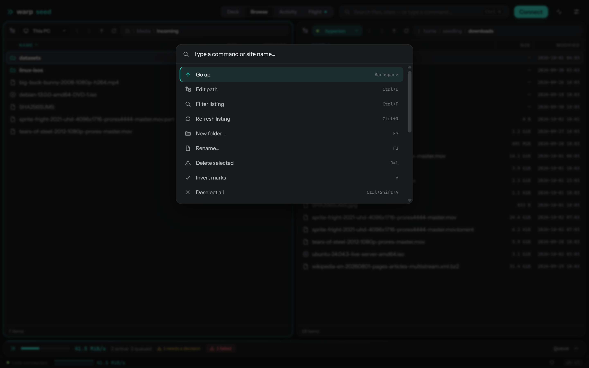

---

## Where your data lives

| What | Where |
|---|---|
| Sites, queue, bookmarks, settings, pinned host keys | `%APPDATA%\warpseed\warpseed.db` (SQLite) |
| Passwords | Windows Credential Manager (`warpseed/*` entries) |
| The app itself | Wherever you put `warpseed.exe` |

**Backup:** Settings → Data → **Back up now** copies the database into a
`backups\` folder beside it, named with a timestamp. To restore, close warpseed, delete `warpseed.db`
**and** any `warpseed.db-wal` / `warpseed.db-shm` beside it, then rename
the backup to `warpseed.db`. (Leaving the `-wal` file behind would replay
old changes over the restored copy.)

**Uninstall:** delete `warpseed.exe`, the `%APPDATA%\warpseed` folder, and
the `warpseed/*` entries in Credential Manager. Nothing else is touched.

---

## Troubleshooting

**"Windows protected your PC"** — see [Install](#install). Verify the
checksum, then More info → Run anyway.

**Blank window on launch** — WebView2 is missing. Install the
[Evergreen WebView2 Runtime](https://developer.microsoft.com/microsoft-edge/webview2/)
from Microsoft, then relaunch.

**Transfers stall at one speed no matter what** — your provider caps each
connection. Turn on Hyperlane (Settings → Hyperlane · Downloads → Lanes
per file: 8) and raise *Connections per site* to at least that number. Uploads have their
own lane count in Hyperlane · Uploads — raising the download one does
nothing for them.

**"Too many connections" / logins refused** — the provider limits
simultaneous connections per IP. Lower *Connections per site* and both
*Lanes per file* values to stay under the limit. The log records what the
server actually granted ("site 1 granted 4/6 connections"), which is the
quickest way to find your real ceiling.

**Hyperlane says 8 lanes but transfers use fewer** — the lane count cannot
exceed the connection budgets in Settings → Transfers; Settings says so
under the lane field when it is being limited. Raise *Connections per site*
(and *Connections, all sites*) to at least the lane count.

**Host key changed** — warpseed refuses to connect on purpose. If your
provider migrated servers they'll have announced it; confirm with them,
then delete and re-add the site to re-pin the key. If they didn't, don't
connect.

**Reporting a stall or a slow cancel** — Settings → About → *Verbose log*,
reproduce the problem, then *Open log folder* and send `warpseed.log`. The
verbose lines show each lane's byte range, how long its first write took,
and when a cancel was requested against when the lanes let go. Turn it off
afterwards; it is chatty.

**A transfer keeps failing** — the row shows the reason. Idle timeouts and
resets retry automatically and resume at the byte they reached; if it
exhausts retries, hit retry once the server is responsive again.

**Reset everything** — close warpseed and delete `%APPDATA%\warpseed`.

---

## Getting help

Use **Settings → Data & About → Report a bug**, or open an issue at
**github.com/cerkie/warpseed/issues** with what happened, what you expected, and
your warpseed version. Reports are handled on an urgency basis.

warpseed is free and always will be. If it saves you time,
[a coffee keeps the updates coming](https://buymeacoffee.com/zyralabs).

Source: [github.com/ZyraLabs/warpseed](https://github.com/ZyraLabs/warpseed) · MIT © 2026 Zyra Labs

## Moving files

Drag files between the panes to copy them. Hold **Shift** while dropping (or
press **F6**) to move them instead.

- Between This PC and a server, a move copies the files and deletes the
  originals only after each copy has arrived complete. Folders that end up
  empty are removed too. If a delete fails, the original stays and warpseed
  says so.
- Inside one folder tree (on This PC, or on one server) a move is a rename:
  nothing is transferred. You cannot move directly from one server to another.
- Drag without Shift between two panes of the same kind and a small note
  beside the cursor tells you to hold Shift.

## Other things worth knowing

- **Bandwidth schedule** (Settings, Transfers): slow transfers down between two
  hours of the day. It can only tighten the limit you already set.
- **Notifications** (Settings, General): a desktop notice when the queue
  finishes while warpseed is in the background.
- **Transfer history** (Settings, Data & About, or Ctrl+K): finished transfers
  you have cleared from the queue.
- **Connect on launch** is a checkbox on each saved site.
- **Columns:** right-click the column headings to hide Size or Modified.
